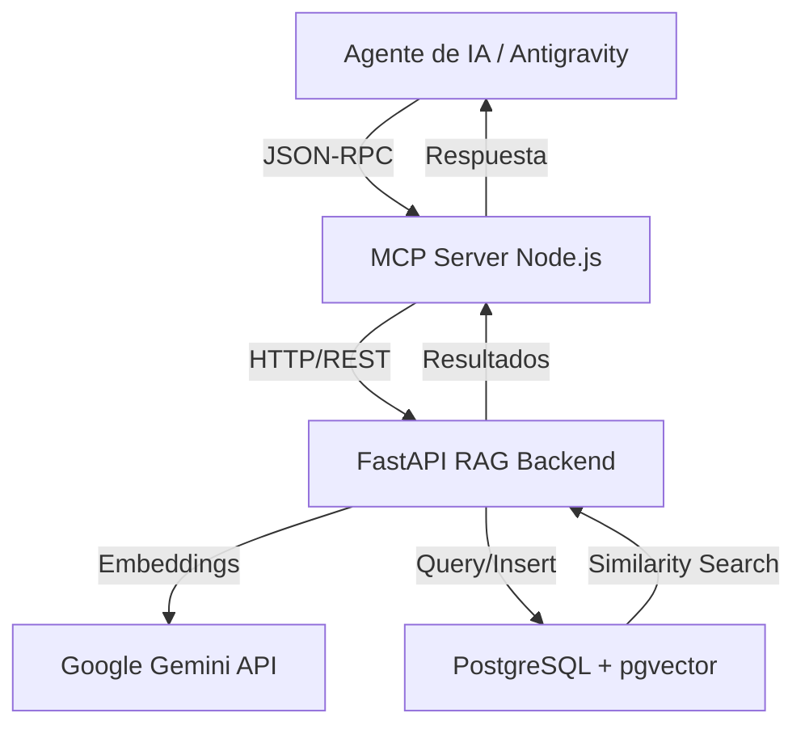

# Arquitectura del Sistema: Memoria RAG v2 MCP

Este proyecto implementa un sistema de memoria semántica persistente diseñado para agentes de IA, utilizando una arquitectura de microservicios ligera pero potente.

## Diagrama de Flujo

## Componentes

### 1. RAG Core (FastAPI + Python)
El cerebro del sistema. Se encarga de:
- **Chunking**: Fragmentación inteligente de textos largos.
- **Embeddings**: Generación de vectores usando el modelo `gemini-embedding-2-preview` (1536 dimensiones).
- **Almacenamiento Vectorial**: Persistencia en PostgreSQL utilizando la extensión `pgvector` para realizar búsquedas de similitud por coseno.
- **Multitenancy**: Aislamiento de datos mediante `project_id`.

### 2. MCP Server (Node.js)
El puente de comunicación. Implementa el **Model Context Protocol**:
- Se comunica con los agentes vía `stdio` (entrada/salida estándar).
- Traduce las llamadas a herramientas (tools) en peticiones HTTP al Backend de FastAPI.
- Maneja la configuración específica del proyecto sin exponer claves de API al cliente final.

### 3. Base de Datos (PostgreSQL + pgvector)
Almacena tanto la memoria en texto plano como sus representaciones vectoriales.
- Tabla `memories_v2`: Metadatos y contenido original.
- Tabla `memory_chunks_v2`: Fragmentos de texto con su correspondiente vector de embedding.

## Seguridad y Portabilidad
- **Variables de Entorno**: No hay claves hardcodeadas. Se utiliza `.env` para manejar secretos.
- **Aislamiento**: Cada proyecto tiene su propio espacio de búsqueda, evitando fugas de contexto entre diferentes repositorios o tareas.
